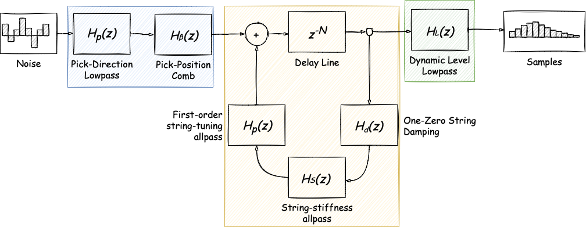
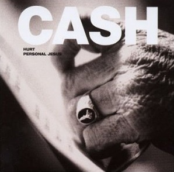

[comment]: # (Set the theme:)
[comment]: # (THEME = white)
[comment]: # (CODE_THEME = vs)
[comment]: # (The list of themes is at https://revealjs.com/themes/)
[comment]: # (The list of code themes is at https://highlightjs.org/)

[comment]: # (controls: true)
[comment]: # (keyboard: true)
[comment]: # (markdown: { smartypants: true })
[comment]: # (hash: false)
[comment]: # (respondToHashChanges: false)

## Programming Guitar Music

----------

Timur Iskhakov

[comment]: # (!!!)

### About

- Software developer at Futurice (Helsinki)
- Work with Go for 4 years coming from C#/.NET
- Blog tech stuff: https://timiskhakov.github.io
- Love music

[comment]: # (!!!)

### Agenda

- Sound in computers
- Karplus-Strong algorithm
- Extended Karplus-Strong algorithm
- Sound in Go
- Modeling a guitar

[comment]: # (!!!)

## Sound in Computers

[comment]: # (!!!)

### Visual Representation


[comment]: # (!!!)

### Frequency


<div style="font-size: 0.5em;">
	<ul>
		<li>A repetition of the waveform</li>
		<li>Measured is Hz, the number of waveform repetitions in one second</li>
		<li>Fun fact: humans can only detect sounds between 20 Hz to 20 kHz</li>
	</ul>
</div>

[comment]: # (!!!)

### Length


<div style="font-size: 0.5em;">
	<ul>
		<li>How long the wave is</li>
		<li>Measured in time units</li>
	</ul>
</div>

[comment]: # (!!!)

### Sampling


<div style="font-size: 0.5em;">
	<ul>
		<li>Measured in Hz</li>
		<li>Sample rate, how many samples in one second</li>
		<li>A common sample rate in audio processing: 44,100 Hz</li>
	</ul>
</div>

[comment]: # (!!!)

### Sine Wave

`$$ y(n) = sin(2 \pi f n) $$`

```go
const SampleRate = 44100

func Synthesize(f float64, duration float64) []float64 {
  size := float64(duration * SampleRate)
  samples := make([]float64, size)
  for i := range samples {
    n := float64(i)
    samples[i] = math.Sin(2 *math.Pi * f * n / size)
  }

  return samples
}

```

<audio controls>
	<source src="tune.wav" type="audio/wav">
</audio>

[comment]: # (!!!)

## Karplus-Strong Algorithm

[comment]: # (!!!)

### Overview


<div style="font-size: 0.5em;">
	<ul style="list-style-type: none">
		<li>Noise: array of random numbers between -1 and 1</li>
		<li>Delay Line: component that models sound's propagation delay</li>
		<li>$$ y(n) = x(n - N) $$</li>
		<li>Lowpass: filter for impedering high-frequency values</li>
		<li>$$ y(n) = \dfrac{x(n) + x(n + 1)}{2} $$</li>
	</ul>
</div>

[comment]: # (!!!)

### Implementation

```go
func Synthesize(frequency float64, duration float64) []float64 {
  noise := make([]float64, int(SampleRate/frequency))
  for i := range noise {
    noise[i] = rand.Float64()*2 - 1
  }

  samples := make([]float64, int(SampleRate*duration))
  for i := range noise {
    samples[i] = noise[i]
  }

  for i := len(noise); i < len(samples); i++ {
    samples[i] = (samples[i-len(noise)] + samples[i-len(noise)+1]) / 2
  }

  return samples
}
```

[comment]: # (!!!)

### Results

First string:

<audio controls>
	<source src="string1b.wav" type="audio/wav">
</audio>

Sixth string:

<audio controls>
	<source src="string6b.wav" type="audio/wav">
</audio>

[comment]: # (!!!)

## Extended Karplus-Strong Algorithm

[comment]: # (!!!)

### Overview


[comment]: # (!!!)

### Groups



<div style="font-size: 0.5em;">
	<ul>
		<li>Noise filters</li>
		<li>Single sample filters</li>
		<li>All samples filters</li>
		<li>Each filter is represented as a Z-transform</li>
	</ul>
</div>

[comment]: # (!!!)

### Z-transform

General form:

`$$ H(z) = 1 + z^{-1} $$`

expands into:

`$$ y(n) = x(n) + x(n -1) $$`

<div style="font-size: 0.5em;">
	<ul>
		<li><code>x</code> — input array</li>
		<li><code>x</code> — output array</li>
		<li>for each out-of-range argument the result is <code>0</code>, e.g. <code>x(-1) = 0</code></li>
	</ul>
</div>

[comment]: # (!!!)

### Pick-Direction Lowpass — Math

`$$ H_p(z) = \dfrac{1 - p}{1 - pz^{-1}} $$`

expands into:

`$$ y(n) = (1 - p)x(n) + py(n - 1) $$`

<div style="font-size: 0.5em;">
	<ul>
		<li><code>p</code> affects the direction of the pick</li>
		<li>Constraints: <code>0 <= p <= 0.9</code></li>
	</ul>
</div>

[comment]: # (!!!)

### Pick-Direction Lowpass — Impl

```go
const p = 0.9

func pickDirectionLowpass(noise []float64) {
  buffer := make([]float64, len(noise))
  buffer[0] = (1 - p) * noise[0]
  for i := 1; i < len(noise); i++ {
    buffer[i] = (1-p)*noise[i] + p*buffer[i-1]
  }
  noise = buffer
}
```

[comment]: # (!!!)

### Pick-Position Comb - Math

`$$ H_\beta(z) = 1 - z^{-int(\beta N + \frac 1 2)} $$`

expands into:

`$$ y(n) = x(n) - x(n - int(\beta N + \frac 1 2)) $$`

<div style="font-size: 0.5em;">
	<ul>
		<li><code>β</code> is responsible for the pick positiop</li>
		<li>Constraints: <code>0 <= β <= 1</code></li>
	</ul>
</div>

[comment]: # (!!!)

### Pick-Position Comb - Impl

```go
const b = 0.1

func pickPositionComb(noise []float64) {
  pick := int(b*float64(len(noise)) + 0.5)
  if pick == 0 {
    pick = len(noise)
  }
  buffer := make([]float64, len(noise))
  for i := range noise {
    if i-pick < 0 {
      buffer[i] = noise[i]
    } else {
      buffer[i] = noise[i] - noise[i-pick]
    }
  }
  noise = buffer
}
```

[comment]: # (!!!)

### Delay Line - Math

`$$ H(z) = z^{-N} $$`

expands into:

`$$ y(n) = x(n - N) $$`

<div style="font-size: 0.5em;">
	<ul>
		<li><code>N</code> is the size of the noise array</li>
		<li>Same formula in the basic Karplus-Strong</li>
	</ul>
</div>

[comment]: # (!!!)

### Delay Line - Impl

```go
func delayLine(samples []float64, n, N int) float64 {
  if n-N < 0 {
    return 0
  }
  return samples[n-N]
}
```

[comment]: # (!!!)

### One-Zero String Damping - Math

`$$ H_d(z) = (1 - S) + Sz^{-1} $$`

expands into:

`$$ y(n) = (1 - S)x(n) + Sx(n - 1) $$`

<div style="font-size: 0.5em;">
	<ul>
		<li><code>S</code> is called the stretching factor</li>
		<li><code>S</code> affects on string decay</li>
		<li>Constraints: <code>0 <= S <= 1</code></li>
	</ul>
</div>

[comment]: # (!!!)

### One-Zero String Damping - Impl

```go
const s = 0.5 

func oneZeroStringDamping(samples []float64, n, N int) float64 {
  return (1-s)*delayLine(samples, n, N) + s*delayLine(samples, n-1, N)
}
```

[comment]: # (!!!)

### String-Stiffness Allpass - Math

`$$ H_s(z) = z^{-K} \dfrac{\tilde{A}(z)}{A(z)} $$`

expands into... something:

[comment]: # (!!!)

### First-Order String Tuning Allpass - Math

`$$ H_p(z) = \dfrac{C + z^{-1}}{1 + Cz^{-1}} $$`

expands into:

`$$ y(n) = Cx(n) + x(n - 1) - Cy(n - 1) $$`

<div style="font-size: 0.5em;">
	<ul>
		<li><code>C</code> affects the string delay</li>
		<li>Constraints: <code>-1 <= C <= 1</code></li>
	</ul>
</div>

[comment]: # (!!!)

### First-Order String Tuning Allpass - Impl

```go
const c = 0.1

func firstOrderStringTuningAllpass(samples []float64, n, N int) float64 {
  return c*(oneZeroStringDamping(samples, n, N)-samples[n-1]) + oneZeroStringDamping(samples, n-1, N)
}
```

[comment]: # (!!!)

### Dynamic Level Lowpass - Math (1)

`$$ H_L(z) = \dfrac{\tilde{\omega}}{1 + \tilde{\omega}} \dfrac{1 + z^{-1}}{1 - \dfrac{1 - \tilde{\omega}}{1 + \tilde{\omega}} z^{-1}} $$`

expands into:

`$$ y(n) = \dfrac{\tilde{\omega}}{1 + \tilde{\omega}} (x(n) + x(n - 1)) + \dfrac{1 - \tilde{\omega}}{1 + \tilde{\omega}} y(n - 1) $$`

`$$ \tilde{\omega} = \pi \dfrac{f}{F_s} $$`

[comment]: # (!!!)

### Dynamic Level Lowpass - Math (2)

`$$ x(n) = L^\frac 4 3 x(n) + (1 - L)y(n) $$`

<div style="font-size: 0.5em;">
	<ul>
		<li><code>f</code> is frequency</li>
		<li><code>Fs</code> is the sample rate</li>
		<li><code>L</code> affects the level (volume)</li>
		<li>Constraints: <code>0 <= L <= 1</code></li>
	</ul>
</div>

[comment]: # (!!!)

### Dynamic Level Lowpass - Impl

```go
const l = 0.1

func dynamicLevelLowpass(samples []float64, w float64) {
  buffer := make([]float64, len(samples))
  buffer[0] = w / (1 + w) * samples[0]
  for i := 1; i < len(samples); i++ {
    buffer[i] = w/(1+w)*(samples[i]+samples[i-1]) + (1-w)/(1+w)*buffer[i-1]
  }

  for i := range samples {
    samples[i] = (math.Pow(l, 4/3) * samples[i]) + (1-l)*buffer[i]
  }
}
```

[comment]: # (!!!)

### Putting It All Together

```go
func Synthesize(frequency float64, duration float64) []float64 {
  noise := make([]float64, int(SampleRate/frequency))
  for i := range noise {
    noise[i] = rand.Float64()*2 - 1
  }

  pickDirectionLowpass(noise)
  pickPositionComb(noise)

  n := int(SampleRate*duration)
  samples := make([]float64, n)
  for i := range noise {
    samples[i] = noise[i]
  }

  for i := len(noise); i < len(samples); i++ {
    samples[i] = firstOrderStringTuningAllpass(samples, i, len(noise))
  }

  dynamicLevelLowpass(samples, math.Pi*frequency/SampleRate)

  return samples
```

[comment]: # (!!! data-auto-animate)

### Putting It All Together

```go [11]
func Synthesize(frequency float64, duration float64) []float64 {
  noise := make([]float64, int(SampleRate/frequency))
  for i := range noise {
    noise[i] = rand.Float64()*2 - 1
  }

  pickDirectionLowpass(noise)
  pickPositionComb(noise)

  n := int(SampleRate*duration)
  samples := make([]float64, n) // Don't do this!
  for i := range noise {
    samples[i] = noise[i]
  }

  for i := len(noise); i < len(samples); i++ {
    samples[i] = firstOrderStringTuningAllpass(samples, i, len(noise))
  }

  dynamicLevelLowpass(samples, math.Pi*frequency/SampleRate)

  return samples
```

Significant latency for real-time uses

<!-- .element: data-id="code" -->

[comment]: # (!!!)

### Results

First string:

<audio controls>
	<source src="string1e.wav" type="audio/wav">
</audio>

Sixth string:

<audio controls>
	<source src="string6e.wav" type="audio/wav">
</audio>

[comment]: # (!!!)

## Sound in Go

[comment]: # (!!!)

### Guitar Fretboard


<div style="font-size: 0.5em;">
	Picture source: <a>https://www.reddit.com/r/Guitar/comments/3zjsan/i_made_a_nice_and_simple_fretboard_diagram_enjoy</a>
</div>

[comment]: # (!!!)

### Note Struct

```go
type Note struct {
  String int
  Fret   int
}

var frequencies = map[Note]float64{
  Note{1, 0}:  329.63,
  Note{1, 1}:  349.23,
  // ...
  Note{6, 19}: 246.94,
}
```

[comment]: # (!!!)

### Package `beep`

https://github.com/faiface/beep

```go
type Streamer interface {
  Stream(samples [][2]float64) (int, bool)
  Err() error
}
```

[comment]: # (!!!)

### Sound Struct

```go
type sound struct {
  totalSamples []float64
  processed    int
}

type synthesizer interface {
  Synthesize(frequency float64, duration float64) []float64
}

func newSound(synth synthesizer, note Note, duration float64) *sound {
  return &sound{synth.Synthesize(frequencies[note], duration), 0}
}
```

[comment]: # (!!!)

### Sound Methods

```go
func (s *sound) Stream(samples [][2]float64) (int, bool) {
  if s.processed >= len(s.totalSamples) {
    return 0, false
  }

  if len(s.totalSamples)-s.processed < len(samples) {
    samples = samples[:len(s.totalSamples)-s.processed]
  }

  for i := range samples {
    samples[i][0] = s.totalSamples[s.processed+i]
    samples[i][1] = s.totalSamples[s.processed+i]
  }

  s.processed += len(samples)

  return len(samples), true
}

func (s *sound) Err() error {
  return nil
}
```

[comment]: # (!!!)

## Modeling a guitar

[comment]: # (!!!)

### Guitar Struct

```go
type Guitar struct {
  synth synthesizer
}

func NewGuitar(synth synthesizer) *Guitar {
  return &Guitar{synth}
}

```

[comment]: # (!!!)

### Guitar Pluck

```go
func (g *Guitar) Pluck(note Note, duration float64) beep.Streamer {
  return newSound(g.synth, note, duration)
}
```

[comment]: # (!!!)

### Guitar Chord

```go
func (g *Guitar) Chord(notes []Note, duration, delay float64) beep.Streamer {
  streamers := make([]beep.Streamer, len(notes))
  for i, note := range notes {
    silence := beep.Silence(int(SampleRate * delay * float64(i)))
    sound := newSound(g.synth, note, duration-delay*float64(i))
    streamers[i] = beep.Seq(silence, sound)
  }

  return beep.Mix(streamers...)
}
```

[comment]: # (!!!)

### Guitar Chord Properties

<audio controls>
	<source src="c-chord.wav" type="audio/wav">
</audio>

If `delay` equals zero, we get a set of notes played together:

<audio controls>
	<source src="c-chord-no-delay.wav" type="audio/wav">
</audio>

If `delay` equals `duration / len(notes)`, we get arpeggio:

<audio controls>
	<source src="arpeggio.wav" type="audio/wav">
</audio>

[comment]: # (!!!)

### Guitar Silence

```go
func (g *Guitar) Silence(duration float64) beep.Streamer {
  return beep.Silence(int(g.sampleRate * duration))
}
```

[comment]: # (!!!)

### Playing Music

```go
func main() {
  kse := karplusstrong.NewExtended()
  guitar := guitar.NewGuitar(kse)

  music := beep.Seq(
    g.Pluck(guitar.Note{1, 0}),
    g.Chord([]guitar.Note{ {5, 3}, {4, 2} }, 1, 0.25),
  )

  speaker.Play(music)
}
```

[comment]: # (!!!)

### Cover on Johnny Cash's Hurt



<audio controls>
	<source src="hurt.wav" type="audio/wav">
</audio>

