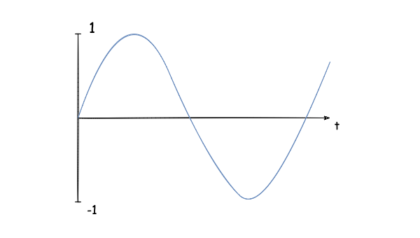
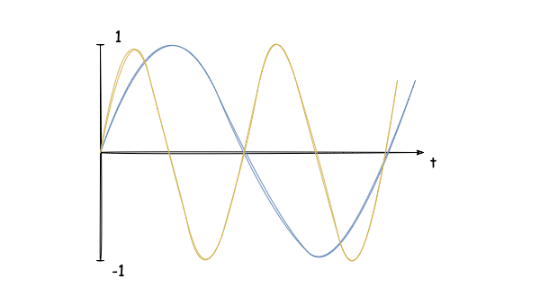
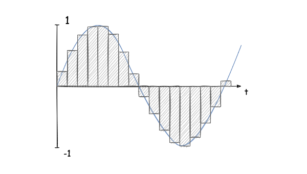
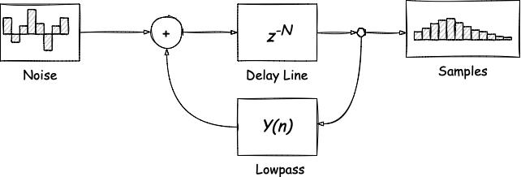
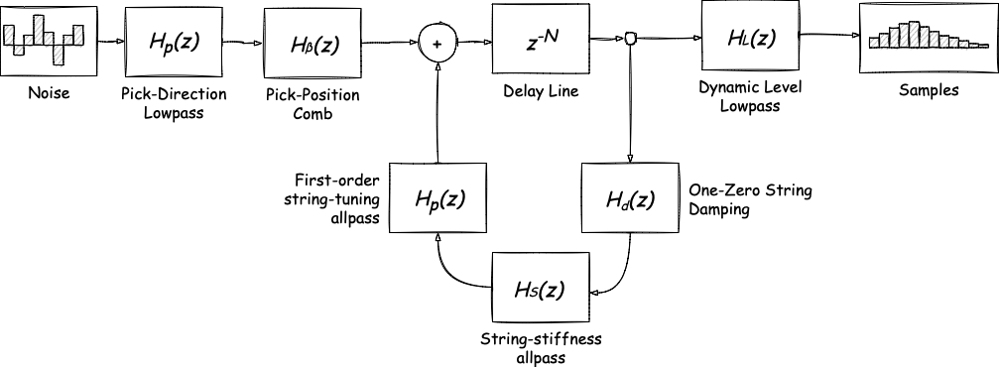
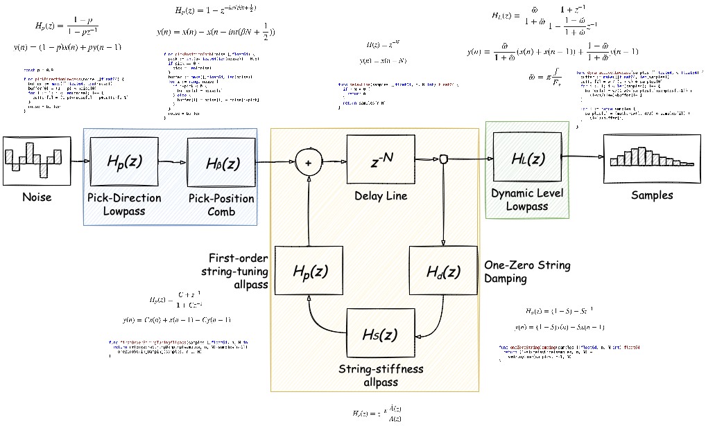
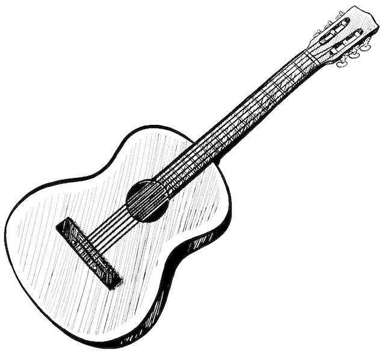
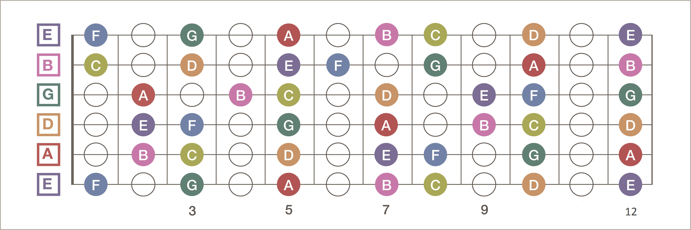

[comment]: # (THEME = white)
[comment]: # (CODE_THEME = vs)
[comment]: # (controls: true)
[comment]: # (keyboard: true)
[comment]: # (markdown: { smartypants: true })
[comment]: # (hash: false)
[comment]: # (respondToHashChanges: false)

## Programming Guitar Music

----------

Timur Iskhakov

[comment]: # (!!!)

### About

- Software developer at Futurice (Helsinki)
- Have been working with Go for 4 years
- Coming from C#/.NET background
- Blog tech stuff: https://timiskhakov.github.io
- Love music and programming for fun

[comment]: # (!!!)

### Agenda

- Sound in computers
- Karplus-Strong algorithm
- Extended Karplus-Strong algorithm
- Sound in Go
- Modeling a guitar
- "Cover" of Johnny Cash's *Hurt*

[comment]: # (!!!)

## Sound in Computers

[comment]: # (!!!)

### What Is Sound

Sound — a complex phenomenon that involves:
- Propagation of acoustic waves
- Pressure compressions
- Reduction in air density

[comment]: # (!!!)

### Visual Representation



[comment]: # (!!!)

### Frequency



<div style="font-size: 0.5em;">
	<ul>
		<li>A repetition of the waveform</li>
		<li>Measured is Hz, the number of waveform repetitions in one second</li>
		<li>Fun fact: humans can only detect sounds between 20 Hz to 20 kHz</li>
	</ul>
</div>

[comment]: # (!!!)

### Length


<div style="font-size: 0.5em;">
	<ul>
		<li>How long the wave is</li>
		<li>Measured in time units</li>
	</ul>
</div>

[comment]: # (!!!)

### Continuous Functions


[comment]: # (!!!)

### Sampling



<div style="font-size: 0.5em;">
	<ul>
		<li>Measured in Hz</li>
		<li>Sample rate, how many samples in one second</li>
		<li>A common sample rate in audio processing: 44,100 Hz</li>
	</ul>
</div>

[comment]: # (!!!)

### Sine Wave

`$$ y(n) = sin(2 \pi f n) $$`

```go [0]
const SampleRate = 44100

func Synthesize(f, duration float64) []float64 {
  size := float64(duration * SampleRate)
  samples := make([]float64, size)
  for i := range samples {
    n := float64(i)
    samples[i] = math.Sin(2 *math.Pi * f * n / size)
  }

  return samples
}
```

<audio controls>
	<source src="tune.wav" type="audio/wav">
</audio>

[comment]: # (!!!)

## Karplus-Strong Algorithm

[comment]: # (!!!)

### Overview



<div style="font-size: 0.5em;">
	<ul style="list-style-type: none">
		<li>Noise: array of random numbers between -1 and 1</li>
		<li>Delay Line: component that models sound's propagation delay</li>
		<li>$$ y(n) = x(n - N) $$</li>
		<li>Lowpass: filter for impedering high-frequency values</li>
		<li>$$ y(n) = \dfrac{x(n) + x(n + 1)}{2} $$</li>
	</ul>
</div>

[comment]: # (!!!)

### Implementation

```go [0|8]
func Synthesize(frequency, duration float64) []float64 {
  noise := make([]float64, int(SampleRate/frequency))
  for i := range noise {
    noise[i] = rand.Float64()*2 - 1
  }

  size := int(SampleRate*duration)
  samples := make([]float64, size)
  for i := range noise {
    samples[i] = noise[i]
  }

  for i := len(noise); i < len(samples); i++ {
    samples[i] = (samples[i-len(noise)] + samples[i-len(noise)+1]) / 2
  }

  return samples
}
```

[comment]: # (!!!)

### Results

First string:

<audio controls>
	<source src="string1b.wav" type="audio/wav">
</audio>

Sixth string:

<audio controls>
	<source src="string6b.wav" type="audio/wav">
</audio>

[comment]: # (!!!)

## Extended Karplus-Strong Algorithm

[comment]: # (!!!)

### Overview



[comment]: # (!!!)

### It Escalated Quickly



[comment]: # (!!!)

### I Got You Covered

https://timiskhakov.github.io/posts/programming-guitar-music

[comment]: # (!!!)

### Benefits

Extended version provides parameters for controlling:
- String pick direction
- The position of the pick
- String decay
- String delay
- Sound loudness



<span style="font-size: 12px;">Picture source: <a>https://www.freepik.com/free-vector/vector-hand-drawn-icon-guitarra-isolated-white-background_20623004.htm</a></span>

[comment]: # (!!!)

### Results

First string:

<audio controls>
	<source src="string1e.wav" type="audio/wav">
</audio>

Sixth string:

<audio controls>
	<source src="string6e.wav" type="audio/wav">
</audio>

[comment]: # (!!!)

## Sound in Go

[comment]: # (!!!)

### Guitar Fretboard



<div style="font-size: 0.5em;">
	Picture source: <a>https://www.reddit.com/r/Guitar/comments/3zjsan/i_made_a_nice_and_simple_fretboard_diagram_enjoy</a>
</div>

[comment]: # (!!!)

### Note Struct

```go [0]
type Note struct {
  String int
  Fret   int
}

var frequencies = map[Note]float64{
  Note{1, 0}:  329.63,
  Note{1, 1}:  349.23,
  // ...
  Note{6, 19}: 246.94,
}
```

[comment]: # (!!!)

### Sound Struct

```go [1-4|6-8|10-17]
type sound struct {
  totalSamples []float64
  processed    int
}

type synthesizer interface {
  Synthesize(frequency, duration float64) []float64
}

func newSound(synth synthesizer, note Note, duration float64) *sound {
  frequency := frequencies[note]
  samples := synth.Synthesize(frequency, duration)
  return &sound{
    totalSamples: samples,
    processed: 0,
  }
}
```

[comment]: # (!!!)

### Package `beep`

https://github.com/faiface/beep

```go [0]
type Streamer interface {
  Stream(samples [][2]float64) (int, bool)
  Err() error
}
```

[comment]: # (!!!)

### Sound Methods

```go [0|3|17|20-22]
func (s *sound) Stream(samples [][2]float64) (int, bool) {
  if s.processed >= len(s.totalSamples) {
    return 0, false // End of streaming
  }

  if len(s.totalSamples)-s.processed < len(samples) {
    samples = samples[:len(s.totalSamples)-s.processed]
  }

  for i := range samples {
    samples[i][0] = s.totalSamples[s.processed+i]
    samples[i][1] = s.totalSamples[s.processed+i]
  }

  s.processed += len(samples)

  return len(samples), true // Keep going
}

func (s *sound) Err() error {
  return nil
}
```

[comment]: # (!!!)

## Modeling a guitar

[comment]: # (!!!)

### Guitar Struct

```go [0]
type Guitar struct {
  sampleRate int
  synth      synthesizer
}

func NewGuitar(sampleRate int, synth synthesizer) *Guitar {
  return &Guitar{sampleRate, synth}
}

```

[comment]: # (!!!)

### Guitar Pluck

```go [0]
func (g *Guitar) Pluck(note Note, duration float64) beep.Streamer {
  return newSound(g.synth, note, duration)
}
```

[comment]: # (!!!)

### Guitar Chord

```go [0|2|4|5|6|9]
func (g *Guitar) Chord(notes []Note, duration, delay float64) beep.Streamer {
  streamers := make([]beep.Streamer, len(notes))
  for i, note := range notes {
    silence := beep.Silence(int(SampleRate * delay * float64(i)))
    sound := newSound(g.synth, note, duration-delay*float64(i))
    streamers[i] = beep.Seq(silence, sound)
  }

  return beep.Mix(streamers...)
}
```

[comment]: # (!!!)

### Guitar Chord Properties

<audio controls>
	<source src="c-chord.wav" type="audio/wav">
</audio>

`delay == 0`

a set of notes played together

<audio controls>
	<source src="c-chord-no-delay.wav" type="audio/wav">
</audio>

`delay == duration / len(notes)`

arpeggio

<audio controls>
	<source src="arpeggio.wav" type="audio/wav">
</audio>

[comment]: # (!!!)

### Guitar Silence

```go [0]
func (g *Guitar) Silence(duration float64) beep.Streamer {
  return beep.Silence(int(g.sampleRate * duration))
}
```

[comment]: # (!!!)

### Playing Music

```go [0]
func main() {
  kse := karplusstrong.NewExtended()
  guitar := guitar.NewGuitar(kse)

  music := beep.Seq(
    g.Pluck(guitar.Note{1, 0}),
    g.Chord([]guitar.Note{ {5, 3}, {4, 2} }, 1, 0.25),
  )

  speaker.Play(music)
}
```

[comment]: # (!!!)

## "Cover"

[comment]: # (!!!)

### Johnny Cash's *Hurt*

[comment]: # (!!! data-auto-animate)

### Johnny Cash's *Hurt*

I know, I know, it barely reaches a MIDI level...

...but hey, we just created this melody out of nowhere!

[comment]: # (!!! data-auto-animate)

### Johnny Cash's *Hurt*

I know, I know, it barely reaches a MIDI level...

...but hey, we just created this melody out of nowhere!

#### Thank You!

<div style="font-size: 0.4em;">
	Contact<br>
	<ul>
		<li>Email: <a>timiskhakov@gmail.com</a></li>
		<li>Blog: <a>https://timiskhakov.github.io</a></li>
		<li>LinkedIn: <a>https://www.linkedin.com/in/timiskhakov</a></li>
	</ul>
	<br><br>
	Links<br>
	<ul>
		<li>Code: <a>https://github.com/timiskhakov/music</a></li>
		<li>Slides: <a>https://github.com/timiskhakov/music-slides</a></li>
		<li>Post: <a>https://timiskhakov.github.io/posts/programming-guitar-music</a></li>
	</ul>
</div>

<audio controls autoplay>
  <source src="hurt.wav" type="audio/wav">
</audio>

[comment]: # (!!! data-auto-animate)
